🚧 NOTICE: This is a WIP meaning that V1 has not been released yet and we are still in the process of developing the core functionality so be prepared for messyness and sporatic breaking changes.

# Contributing Guidelines

Fork the repo and submit a PR with your changes. 

*(No specific format is required for PRs at this point...as long as its reasonable/understandble and focuses on the core development areas needed (discussed below) it will be integrated.)*

## Directory Structure

```sh
# START: EXPLAINER FILES/FOLDERS
├── CONTRIBUTING.md # 🎯 you are here
├── README.md # entry point for the repo
├── LICENSE.md # available to use by anyone for anything
├── docs # docs for the codebase (TODO: currently just scaffolded)
├── images # for images in README or other top-level .md files
# END: EXPLAINER FILES/FOLDERS

# START: USER RELEVANT FILES/FOLDERS
├── data # the folder that contains project/session data (project folder, templates and output worksheets, final reports, annotated pdfs, etc)
│   ├── demo-01 # the users project folder (this one is called demo-01) 3 things (designs, submittals, and scope)
│   └── templates # equipment templates (used to determine what specs to look for given a piece of equipment)
├── cli-config.yaml # the configs for the CLI interface (fonts/welcome/done messages/etc)
├── session-config.yaml # the configs for the session (additional agent prompts, location of files/folders, etc)
├── .env # user and/or devs will need to create this
# END: USER RELEVANT FILES/FOLDERS


# START: MECHE COPILOT CODE
├── meche_copilot # all meche_copilot code
│   ├── chains # custom langchain chains for reading designs, submittals, etc
│   ├── cli # scripts for the CLI interface (generate-ws, fillout-ws, generate-report, generate-annots)
│   ├── get_comparison_results.py # idr what i was doing with these...
│   ├── get_eq_specs_and_comps.py # idr what i was doing with these...
│   ├── get_equipment_results.py # idr what i was doing with these...
│   ├── pdf_helpers # things to help deal with pdfs (parsing, annotating, etc)
│   ├── schemas.py # pydantic schemas for the data
│   └── utils # utility functions (dataframe chunking, etc)
├── tests # all meche_copilot tests
│   ├── _test_data # data for running tests
│   ├── _test_results # outputs for tests that write to disk
│   ├── evals # evals are things that need to be manually reviewed by humans (like is it highlighting pdfs correctly, is the agent outputting the correct specs, etc)
│   └── unit_tests # all unit tests
# END: MECHE COPILOT CODE

# START: DEV CONTAINER/DEVELOPMENT FILES/FOLDERS
├── .devcontainer # the configs for launching the dev container
├── Dockerfile # production build dockerfile
├── dev.Dockerfile # dev build dockerfile
├── Makefile # makefile for running linting, etc
├── poetry.toml # poetry config
├── pyproject.toml # poetry config
# END: DEV CONTAINER/DEVELOPMENT FILES/FOLDERS
```

## Major TODOs Before V1 Release

**Contributing in places with TODO tags is preferred (but not required)**

In addition to TODOs found in the codebase, the following are areas need development work:

- **Tests**: 
    + unit tests: only some unit tests are complete, some are scaffolded, and some are missing.
    + evals: evals are partially complete and need to be finished

    Notes on evals:
    - tests are for code - like is the code running correctly, handling errors properly, etc
    - evals are for things that need to be evauated by a human - like is the annotation correctly formatted, did the agent reply correctly, etc and are ipynb notebooks that help assess the quality of the agents responses and allow us to play with different prompts and see how that affects the reports and such. There is no right/wrong or pass/fail with evals but rather humans need to manually review the agents work and figure out where they are doing well and where they are not. Specifically, this code runs with three major/distinct agents that work together to fillout the worksheet
        + agent 1: document retreival: this agents job is to get the relavent page(s) or section(s) of the user documetns in order for the others to take a closer look/analyze. This is necessary because design documents and submittals can be rather lengthy
        + agnet 2: specs lookup: this agents job is to look at the relavent page(s) or section(s) of the user documetns and determine what specs are being used for each piece of equipment
        + agent 3: specs comparison: this agents job is to compare the specs retreived from the designs to the ones from the submittal and comment on if the specs match or not

        Currently there are 
        - "prelim evals" which was me playing and assessing how I'd do this project
        - analyze specs chain eval to see how well the llms analyze specs on docs
        - camelot eval which evaluates how well camelot parses tables in pdfs
        - read design chain eval which evaluates how well the agents read design docs
        - read submittal chain eval which evaluates how well the agents read submittal docs

        I have been running them locally (poetry install locally so you have a local .venv to point the kernel to but it should prob be set up so they can just run automatically from the dev container kernel/docker)

- **Generate annots script**: the script that generates annotations from the excel sheet notes needs to be written. All of the components to do it are dont but we are waiting for the project owner to provide examples of how engineering annotations should look stylistically.

- **Linting**: Started a Makefile to make it easy for devs (and later github actions) to run linting and things but didn't finish this. This needs to be robust before release.

- **Usage Scripts**: Currently the main scripts that the user runs are generate-ws, fillout-ws, generate-report and generate-annots (see pyproject.toml). However it would be nice to have a script for preprocessing the data for the ```ReadDesignChain``` and ```ReadSubmittalChain``` in case users want to just run those individually and not wait for the whole generate-ws/fillout-ws/etc workflow. (Also fillout-ws can take a while depending on the size of the submittal so it would be nice to have a way to run that separately as well)

- **Docs**: We need to write documentation for the codebase. This should be done using Jupyter Notebooks and Sphinx (on readthedocs). The docs should be written in a way that allows for easy contribution from the community.

- **Data**: More data to populate the equipment template database is helpful

- **Graphical User Interface**: we decided to just use a CLI for the MVP but if you feel like building out a simple GUI that would be cool.

## Contributing Instructions

### 1) Fork the repo
[Here are some instructions](https://docs.github.com/en/get-started/quickstart/fork-a-repo) on how to do that if you are unfamiliar

### 2) Start docker daemon
Dev container is configured to run docker so it will throw an error if you try to launch the dev container before starting the docker daemon. To launch either run docker gui or run ```docker info``` in terminal

### 3) Launch dev container
From VS-code make sure you have the [DevContainers](https://marketplace.visualstudio.com/items?itemName=ms-vscode-remote.remote-containers) extension intalled then launch the dev container like this or by clicking the green button in the bottom left of the VS-code window
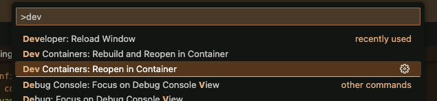

At this point all dev dependencies have been installed and you can start running code, tests, making changes, etc.

### 4) Contribute
Probably wise to start by running unit tests to wrap your head around how things work and are called and unitized. But do whatever suits your fancy.

For example, now your terminal in VS-code will be running in the dev container so you can make sure poetry successfully installed all deps by running ```poetry show``` in the terminal

```sh
# NOTE: you prob need to run poetry install so that meche_copilor is aviable in ipython and in tests scripts 
poetry install
```

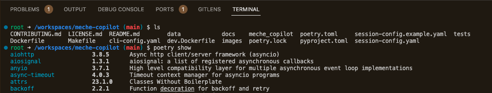

OR you can launch ipython by running ```ipython``` in the terminal

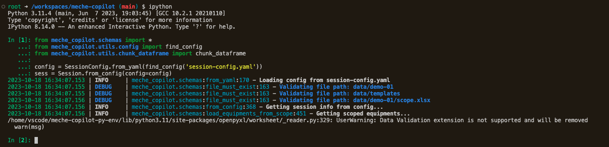

OR you can run unit tests like this

```sh
# runs all unit tests
poetry run pytest tests/unit_tests

# runs a specific unit test for a module/file
poetry run pytest tests/unit_tests/copilot/generate_ws_test.py

# runs a specific unit test within a module/file
poetry run pytest tests/unit_tests/copilot/generate_ws_test.py::test_generate_ws
```

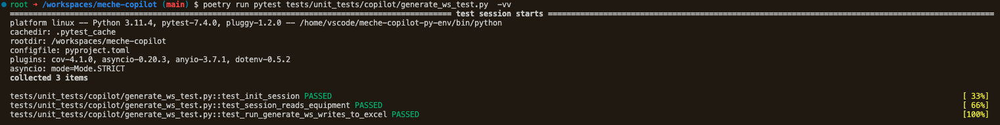
or all tests
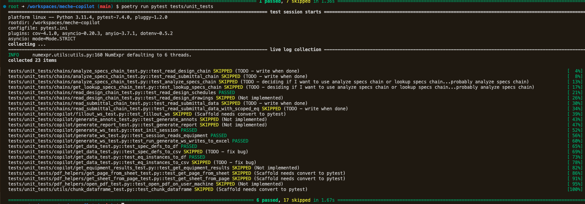

OR you can run any of the scripts by typing copi (tab completion to get the copilot-bla scripts)

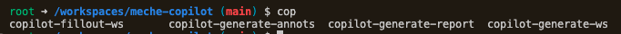

Running the `generate-ws` script looks like this 
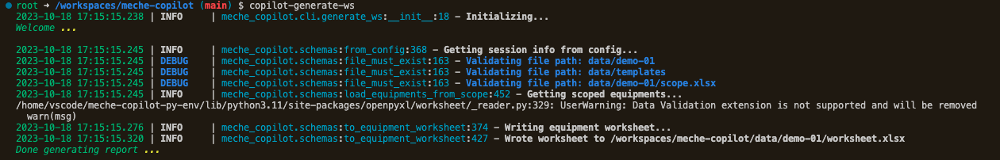

and outputs a worksheet in the data/ dir which has sources, specs definitions and results for each piece of equipment scoped in the scope excel file (specified in session-config.yaml)
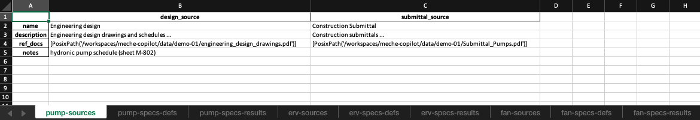

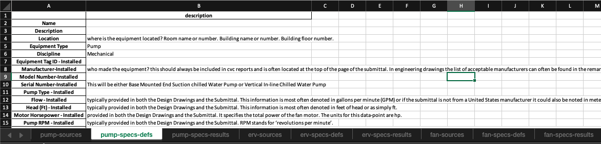

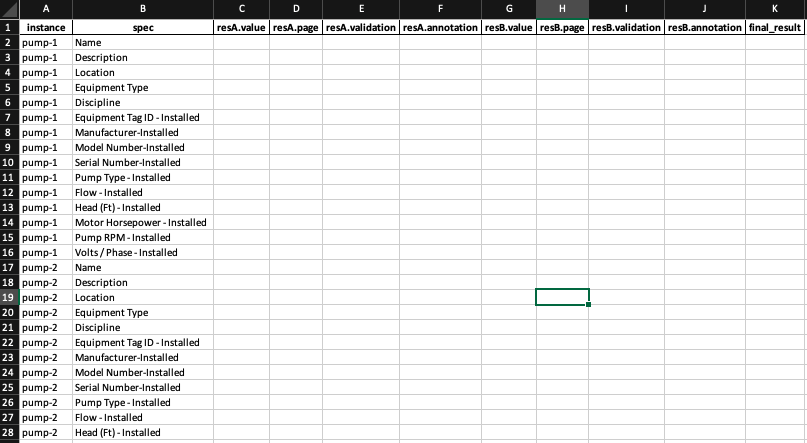

Running the `copilot-fillout-ws` script looks like this - TODO:

Running the `copilot-generate-report` script looks like this - TODO:

Running the `copilot-generate-annots` script looks like this - TODO:


### 5) Submit PR
Once you are done making changes and want to submit a PR you can do so by clicking the "create pull request" button in the github UI

## Development Design Decisions

**1) Why'd you use pdf parsing instead of OCR?**
At the time OCR seemed like a potential rabbit hole/time sink so we tried using pdf parsing (via python's camelot) and its seemed effective so we went with it while acknowleding that a combination of OCR and pdf parsing would be ideal for future releases and if/when a more robust solution is needed.

Towards the end we realized that camelot had trouble parsing tables that were complex multi-line engineering tables like below so we were working on implementing a little postprocessor (see postprocess_camelot_df) where we cleaned up the DF and made a decision about what to use based on what the LLM got for metadata and what camelot extracted. You were in the middle of testing this in nbs (see camelot eval ipynb) and then gonna go through and tie everything together (all the chains and CLI scripts) for the demo. You'd prob have to modify the worksheet depending on how you decide to have the llm do the final lookup/analyze part. 

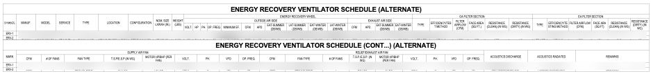

**2) Why didn't you use langchain's prebuilt document retreival chains?**
We tried using various langchain prebuilt document retreival chains (see LookupChain) but its wasn't doing a good/consistent job so we decided to write a custom retreiver for reading designs and submittals (see ```ReadDesignChain``` and ```ReadSubmittalChain```). 

NOTE: these are basically implemented but we didn't finish testing them and tieing them back into the `LookupSpecsChain`. Actually we weren't sure if we were gonna do that or ditch the `LookupSpecsChain` in favor of `AnalyzeSpecsChain `which would ask the LLM on a per spec basis. Perhaps that is overkill and there is a good balance we can do a few+ specs at a time....maybe update the chunker to handle this.

# Additional Gotchas you may run into

- If you are contributing to .ipynb notebooks you need to run `nbstripout --install` so that no nb output is committed