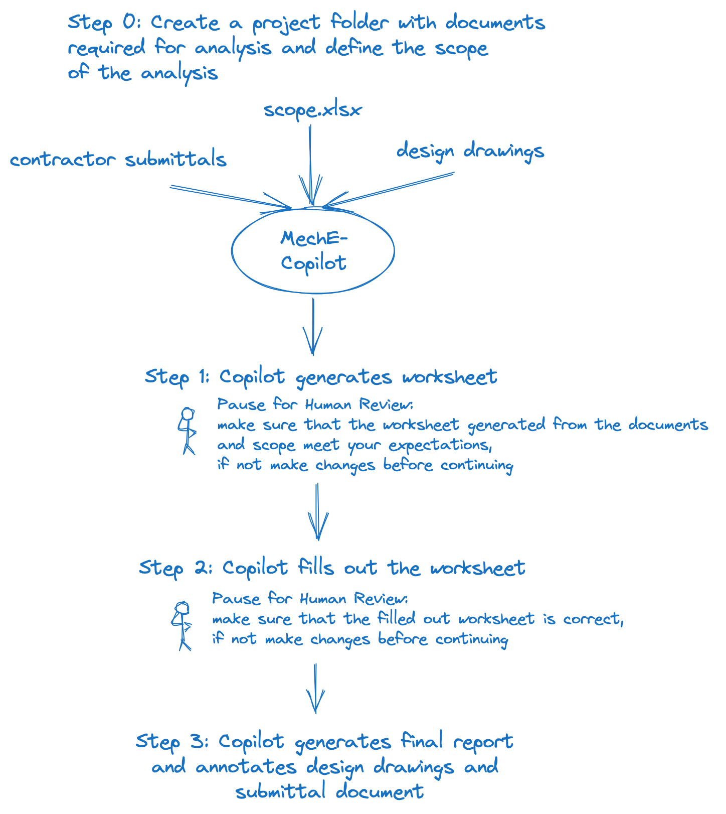

🚧 NOTICE: This is a W.I.P. ([Contributing guidelines here](CONTRIBUTING.md))

# 👷‍♀️ MechE-Copilot

⚡ An opensource tool that allows engineers to compare equipment component specifications between engineering designs and construction submittals. ⚡

*BEGIN: PLACEHOLDER CONTENT*

[](https://github.com/hwchase17/langchain/releases)
[](https://libraries.io/github/langchain-ai/langchain)
[](https://github.com/hwchase17/langchain/issues)


| Feature                                               | Version 0.1.x | Version 0.2.x |
|-------------------------------------------------------|---------------|---------------|
| Works on Windows/OSX/Linux                            | ✅            | ✅            |
| User Interface Style                                  | Command Line  | Graphical User Interface |
| Analyzes equipment from scope                         | ✅            | ✅            |
| Analyzes engineering design drawings                  | ❌            | ❌            |
| Analyzes mechanical schedules                         | ✅            | ✅            |
| Analyzes construction submittals                      | ✅            | ✅            |
| Compares specs between design and submittal documents | ✅            | ✅            |
| Annotates documents with callouts                     | ✅            | ✅            |
*END: PLACEHOLDER CONTENT*

## 🤔 What is it and how does it work?

MecheCopilot is an opensource tool that allows engineers to compare equipment component specifications between engineering designs and construction submittals. 

The typical workflow is that engineers do design work and then a construction company comes in with equipment that supposedly meets the specifications of the engineering designs, however, this verification process between what the engineer designed for and what the specific equipment specs construction company plans to install its a lengthy and tedious verification process that can be largely automated. That is what MecheCopilot is designed to do.

It does so by *looking at the engineering design drawings, construction submittals and project scope provided by the user then generating an excel worksheet* which contains all of the equipment and specs in the project scope. 

Then, after a human has validated the worksheet it *looks up the engineering specs and construction specs* and tries to determine if the construction specs meet the engineering design specs. 

Once the human has reviewed, it *generates a summary report* of discrepancies and can optionally *generate annotations* on either or both the engineering design drawings and construction submittals so that discrepancies can be reviewed.

## ⛔ Limitations and Future Development
This project was developed as proof-of-concept/MVP to demonstrate how software + LLMs can help automate this process. 

If you would like to fund further development that adds a graphical user interface or adds other features specific to your use case you can either 
1) Fork the project, make your changes and then create a pull request so we can integrate your changes or 
2) Contact the developers (create an issue in the issues tab) about funding further development.

Because this project was developed as a proof of concept (MVP) it has the following limitations:

- the system knows what equipment specifications and features to pull based on a template library so if your use case requires uncommon equipment or needs specific equipment characteristics then you will need to add equipment templates to the library for the agents to reference/use as templates.

- companies may require that LLM's used in this project be run locally or on private servers in the case where there are sensitive internal documents. This MVP doesn't deal with that use case.

----------------

# Installation

You can install and run locally or with docker (recommended).

## Install and run with Docker (recommended)

### Prerequisites

Ensure that Docker is installed on your system. If not, [download and install Docker](https://docs.docker.com/engine/install/).

### Instructions

1. Clone the Repository

First, clone the project repository to your local machine.

```bash
git clone https://github.com/TODO
cd meche-copilot
```

2. Build the Docker Image

Build the Docker image using the provided Dockerfile.

```bash
docker build -t TODO .
```

3. Run the Docker Container

Run the Docker container using the image you just built.

```bash
docker run -p 8000:8000 TODO
```

4. When you are done using the program, stop the container.

```bash
docker stop $(docker ps -q --filter ancestor=TODO)
```


## Install and run locally

### Prerequisites

Python, poetry and vscode or whatever IDE you want.
 
### Instructions

1. Clone the Repository

First, clone the project repository to your local machine.

```bash
git clone https://github.com/TODO
cd TODO
```

2. Run using .toml scripts


# Usage

Once installation is complete you can access the application...TODO



## Step 0: Preparation

### one time
- Get an openai api key and add it to your .env file
- Create a config.yaml file

### each time you want to run a new analysis session
- Create a project folder
- Define session scope


## Step 1: Generate the worksheet

Running this command will generate the worksheet from the configs and scope you pre

viously defined. Once its done, you can open the worksheet and make any changes you'd like before it gets filled out in the next step.

Once you are happy with it save and close then move to the next step.

```bash
generate-ws
```

## Step 2: Generate the EDS worksheet answers

Running this command will generate worksheet answers using langchain agents with the tools you provided in the agent-config.yaml. Once its done you can open the filled out worksheet and review the answers and make any changes you want.

Once you are happy with it, save and close then move to the next step.

```bash
# NOTE: this step will take some time especially if your scope is big!
fillout-ws
```

## Step 3: Generate the EDS report from worksheet answers

Running this command will create a nice looking report and annotate the spec files you provided if that is enabled in your config

```bash
generate-report
generate-annots
```

Now you should have a final report that nicely shows the specs of the characteristics of each instance of equipment you scoped along with the annotations on the specs you provided.

## Step 4: Cleanup
run cleanup or do it manually and stop your docker container if you aren't running another analysis session anytime soon.
