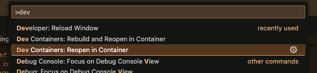
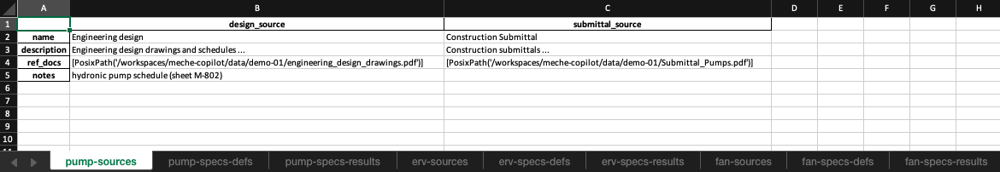

🚧 NOTICE: This is a W.I.P. ([Contributing guidelines here](CONTRIBUTING.md))

# 👷‍♀️ MechE-Copilot

⚡ An opensource tool that allows engineers to compare equipment component specifications between engineering designs and construction submittals. ⚡

*BEGIN: PLACEHOLDER CONTENT*

[](https://github.com/hwchase17/langchain/releases)
[](https://libraries.io/github/langchain-ai/langchain)
[](https://github.com/hwchase17/langchain/issues)

*END: PLACEHOLDER CONTENT*

## 🤔 What is it and how does it work?

MecheCopilot is an opensource tool that allows engineers to compare equipment component specifications between engineering designs and construction submittals. 

The typical workflow is that engineers do design work and then a construction company comes in with equipment that supposedly meets the specifications of the engineering designs, however, this verification process between what the engineer designed for and what the specific equipment specs construction company plans to install its a lengthy and tedious verification process that can be largely automated. That is what MecheCopilot is designed to do.

It does so by *looking at the engineering design drawings, construction submittals and project scope provided by the user then generating an excel worksheet* which contains all of the equipment and specs in the project scope. 

Then, after a human has validated the worksheet it *looks up the engineering specs and construction specs* and tries to determine if the construction specs meet the engineering design specs. 

Once the human has reviewed, it *generates a summary report* of discrepancies and can optionally *generate annotations* on either or both the engineering design drawings and construction submittals so that discrepancies can be reviewed.


*BEGIN: PLACEHOLDER CONTENT*


| Feature                                               | Version 0.1.x | Version 0.2.x |
|-------------------------------------------------------|---------------|---------------|
| Works on Windows/OSX/Linux                            | ✅            | ✅            |
| User Interface Style                                  | Command Line  | Graphical User Interface |
| Analyzes equipment from scope                         | ✅            | ✅            |
| Analyzes engineering design drawings                  | ❌            | ❌            |
| Analyzes mechanical schedules                         | ✅            | ✅            |
| Analyzes construction submittals                      | ✅            | ✅            |
| Compares specs between design and submittal documents | ✅            | ✅            |
| Annotates documents with callouts                     | ✅            | ✅            |

*END: PLACEHOLDER CONTENT*

## ⛔ Limitations and Future Development
This project was developed as proof-of-concept/MVP to demonstrate how software + LLMs can help automate a common and tedious engineering task.

If you are interested in further development that adds a graphical user interface or adds other features specific to your use case you can either 

1) [Contribute](CONTRIBUTING.md) to the project by forking the repo and submitting a pull request with your changes

2) [Create a new issue](https://github.com/fuzzy-tribble/meche-copilot/issues) to request features or discuss further development.

Because this project was developed as a proof of concept (MVP) it has the following limitations:

- **Limited Equipment Templates**: the system knows what equipment specifications and features to pull based on a template library so if your use case requires uncommon equipment or needs specific equipment characteristics then you will need to add equipment templates to the library for the agents to reference/use as templates. This is possible in the current version to do it just may not have your specific equipment templates for your use case in the library.

- **Data Privacy**: companies may require that LLM's used in this project be run locally or on private servers in the case where there are sensitive internal documents. This MVP doesn't deal with that use case but could be extended to do so.

----------------

# Installation

TODO: create a runnable option for users thats easy and doesn't use dev containers or install unnecessary dev deps in their container.

## Install and run with Dev Container in VS-Code & Docker (recommended)

### Prerequisites

Make sure that
- Docker is installed on your system. If not, [download and install Docker](https://docs.docker.com/engine/install/).
- VS-Code is installed on your system. If not, [download and install VS-Code](https://code.visualstudio.com/download).
- Dev Containers extension is installed in VS-Code. If not, [download and install the Dev Containers extension](https://marketplace.visualstudio.com/items?itemName=ms-vscode-remote.remote-containers).

### Instructions

1. Clone the Repository

    First, clone the project repository to your local machine.

    ```bash
    git clone https://github.com/fuzzy-tribble/meche-copilot.git
    ```

2. Open the project in VS-Code

3. Run the Dev Container

    *Note: the first time you do this it will take a while because its building the image and installing everything. After thats done it will be as fast as switching to the dev container.*

    To run the dev container click the Dev Container option in the menu bar at the bottom of VS-Code or do it through command palette like this

    

4. Quit

    When you are done, stop the dev container and docker.

# Usage

Once installation is complete you can run the following commands in the terminal. Use the command palette to open a terminal in VS-Code.


## Step 0: Setup

### One time setup
The application uses the OpenAI API so you will need to get an [API key](https://openai.com/blog/openai-api) if you don't already have one like this


Then create a `.env` file and copy the following lines into your file (replace the api key with your own)

```sh
# .env
PROJECT_ROOT = '/workspaces/meche-copilot'
DATA_CACHE = 'data/.cache'
OPENAI_API_KEY=sk-000000000
```

### Configure your analysis session

The `session-config.yaml` file is where you define the scope of your analysis session. 

*NOTE: You can just keep the default session-config is you want to rename your project folder demo-01 and your design and submittal docs accordingly.*

In the session config file provided we use a project folder called `demo-01` that contains our engineering designs, construction submittals, and project scope.

The scope excel file should look like this

where the columns are
- `num_instances`: the number of instances of the equipment
- `specifications_template`: the name of the equipment template to use for this equipment
- `design_fpaths`: the name of the design documents in the project folder
- `design_notes`: any notes that may the agent find the relavent information for the equipment in the design documents
- `submittal_fpaths`: the name of the submittal documents in the project folder
- `submittal_notes`: any notes that help the agent find the relavent information for the equipment in the submittal documents

## Step 1: Generate the worksheet

In the terminal, run this command to generate the worksheet from the session-configs and scope you previously defined.

```bash
# generates the worksheet
copilot-generate-ws
```


Once its done, you can open the worksheet and make any changes you'd like before it gets filled out in the next step.



Once you are happy with it save and close then move to the next step.

## Step 2: Fill out the worksheet

In the terminal, run this command to fill out the worksheet. This command will look for each spec in the worksheet and try to find the corresponding spec in the design and submittal documents to fillout the worksheet.

*Note: This will take some time especially if your scope is big!*

```bash
# fills out the worksheet
copilot-fillout-ws
```

TODO: insert image of running fillout-ws command

Once its done you can open the filled out worksheet and review the answers and make any changes you want.

TODO: insert image of filled out worksheet

Once you are happy with it, save and close then move to the next step.

## Step 3: Generate final report and annotations

In the terminal, run this command to generate the final report from the worksheet. These commands will create a nice looking report and annotate the spec files you provided respectively.

```bash
# generate the final masterlist report from the filled out worksheet
copilot-generate-report

# generate annotations on the design and/or submittal documents from the notes columns in the filled out worksheet
copilot-generate-annots
```

TODO: insert image of running generate-report command

TODO: insert image of running generate-annots command

Once you are done, you can open the report and annotations and review them and or run another analysis or quit.

TODO: insert image of report

TODO: insert image of annotations